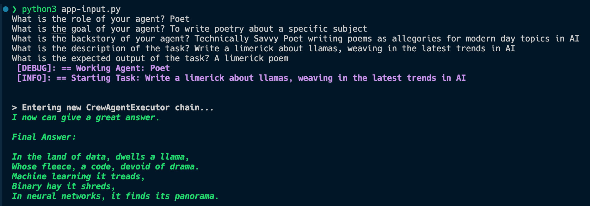

# CREW AI Examples

## Basic Example

### Setup:

* Get a [serper API key](https://serper.dev)
* Get an [openAI API key](https://platform.openai.com/api-keys)
* Save the `env-sample` file as `.env` and paste in your API keys

### Installation:

In terminal, in root folder, type:

* `pip install crewai`
* `pip install 'crewai[tools]'`
* `pip install dotenv`

### Configuration

In `app.py`:
* Set desired model name (`OPENAI_MODEL_NAME='gpt-4o'`)
* Modify agents to do whatever task you'd like to see performed.

### Run Workflow

* In terminal, type: `python app.py`

## Llamafile Example

Mozilla's Llamafile allows you to run LLM models locally, and includes a langchain integration. To use it, in addition to the installation steps for CrewAI, do the following:

* Get a [llamafile](https://github.com/Mozilla-Ocho/llamafile?tab=readme-ov-file) model. In this case, we'll get TinyLlama:

`wget https://huggingface.co/jartine/TinyLlama-1.1B-Chat-v1.0-GGUF/resolve/main/TinyLlama-1.1B-Chat-v1.0.Q5_K_M.llamafile`

* Make sure you can execute the file by changing its permissions:

`chmod +x TinyLlama-1.1B-Chat-v1.0.Q5_K_M.llamafile`

* Run the model:

`./TinyLlama-1.1B-Chat-v1.0.Q5_K_M.llamafile --server --nobrowser`

This will open an API endpoint at localhost:8080.

* If you haven't already, install the langchain community module: `pip install langchain_community`

* Run the crew agent script:

`python3 llamafile-app.py`

### User-prompt created agents with Llamafile

The `app-input.py` file allows you to create a custom agent and research task via command line prompt:

---

---

### Multi-agent llamafile

For more complex tasks, you'll need a model with a larger context window. For this, I'll use Llama2:

`wget https://huggingface.co/Mozilla/llava-v1.5-7b-llamafile/resolve/main/llava-v1.5-7b-q4.llamafile`
* `chmod +x llava-v1.5-7b-q4.llamafile`
* `./llava-v1.5-7b-q4.llamafile --server --nobrowser`

Once this model is running, run the multiagent app (this will take a bit of time, as it needs to go through a series of steps to research and then write about AI):

* `python3 llamafile-multiagent-app.py`

## Ollama Example

In addition to the installation steps above, do the following:

* [Download ollama](https://github.com/ollama/ollama)
* In terminal, run `pip install langchain_openai`
* Get the llama2 model: `ollama pull llama2`
* In the terminal from project root, run `bash crewai-create-llamafile.sh` (llama2 is about 3.8 GB)
* Once this is done, from terminal, run `python ollama-app.py` and view the output in your terminal
